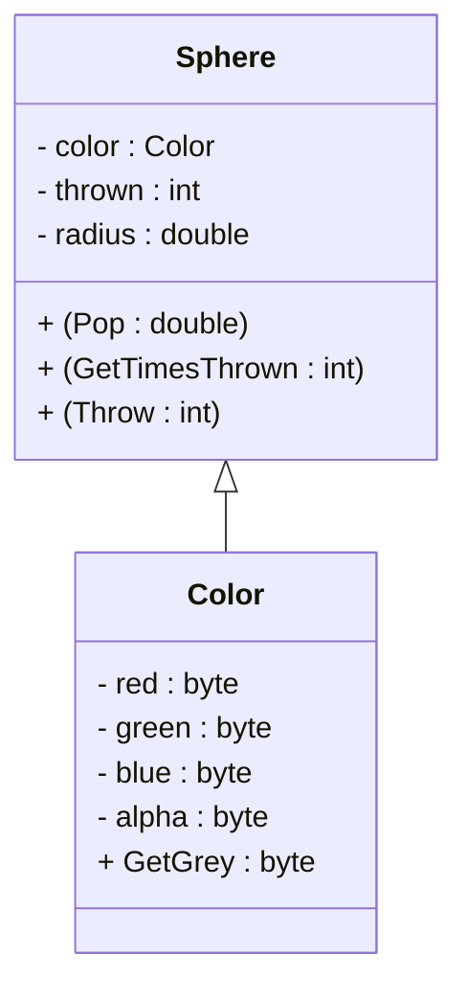

## Mermaid Class Diagram VSCode

```mermaid
classDiagram

class Color{
    - red : byte
    - green : byte
    - blue : byte
    - alpha : byte
    + GetGrey : byte
}
Sphere <|-- Color
class Sphere{
    - color : Color
    - thrown : int
    - radius : double
    + (Pop : double)
    + (GetTimesThrown : int)
    + (Throw : int)
    
}

```